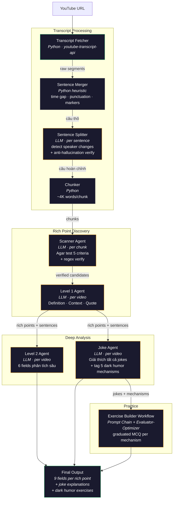

# Agent: Rich Point Discovery

Multi-agent system phát hiện **cultural rich points** (Michael Agar) từ transcript YouTube video bằng AI. Thay vì match against danh sách có sẵn, AI tự đọc transcript và phát hiện từ/cụm từ mang tải văn hoá Mỹ mà non-American sẽ không hiểu.

---

## Architecture



> Nodes viền vàng = LLM agent. Nodes viền xanh = Python only. Nodes viền xám = Python heuristic.

---

## Agents chi tiết

### Transcript Fetcher (`transcript.py`)

Không phải AI agent. Dùng `youtube-transcript-api` để lấy auto-caption từ YouTube.

- **Input:** YouTube URL
- **Output:** `{ segments, sentences, full_text, word_count }`
- **Lưu ý:** Một số video không có caption → skip với error

### Sentence Merger + Splitter + Chunker (`chunker.py`)

Ba bước xử lý:

**Bước 1 — Segments → Sentences thô** (`segments_to_sentences`, heuristic)

YouTube auto-caption trả về mảnh nhỏ (2-5 từ/segment). Function này merge thành câu dựa trên:
- **Time gap** giữa segments (>1s = câu mới)
- **Dấu câu** cuối segment (`. ? !` = câu mới)
- **Bracketed markers** (`[Laughter]`, `[Music]` → standalone)
- **Max 80 words/câu** (force split nếu quá dài)

Ví dụ: 290 segments → 45 câu thô.

**Bước 2 — LLM Sentence Splitter** (`split_sentences_with_llm`, AI agent)

Gửi tất cả câu thô cho LLM để split thành câu nhỏ hơn. LLM detect:
- **Đổi người nói** (question → answer, interjection)
- **Ngữ pháp lệch** (chuyển chủ ngữ, đổi context)
- **Short utterances** ("yeah", "no", "oh" → tách riêng)

- **Model:** `meta-llama/llama-4-scout-17b-16e-instruct` (Groq)
- **Anti-hallucination verify:** Sau khi LLM trả kết quả, code join tất cả parts lại và so sánh với text gốc. Nếu khác bất kỳ từ nào → reject, giữ câu gốc.
- **Rule cho LLM:** CHỈ được chèn ranh giới ngắt, KHÔNG được thêm/xóa/sửa bất kỳ từ nào.

Ví dụ: 45 câu thô → 367 câu hoàn chỉnh.

**Bước 3 — Sentences → Chunks** (`sentences_to_chunks`)

Nhóm các câu thành chunks ~4K words cho Scanner. Không bao giờ cắt giữa câu.

### Scanner Agent (`scanner.py`)

AI agent đầu tiên. Đọc từng chunk transcript và phát hiện candidate rich points.

- **Model:** `meta-llama/llama-4-scout-17b-16e-instruct` (Groq)
- **Input:** 1 chunk transcript (~4K words)
- **Output:** JSON list candidates `{ word, type, pos, sense_tag, agar_score }`
- **Prompt core:**
  - Định nghĩa rich point theo Michael Agar
  - 5 tiêu chí Agar test (cần ≥3/5)
  - Negative examples (tránh over-flag: "cool", "gonna", "rice"...)
  - **Critical rule:** CHỈ trả về từ thực sự có trong transcript text
- **Anti-hallucination:** Sau khi LLM trả kết quả, code check bằng regex xem từ có tồn tại trong transcript không. Không có → drop ngay + log. Đây là fix cho vấn đề LLM hallucinate từ không có trong text (vd: trả "cookout" dù transcript không có từ này).

### Level 1 Agent (`level1.py`)

Nhận candidates đã verified → generate 3 fields "hiểu từ".

- **Model:** `meta-llama/llama-4-scout-17b-16e-instruct` (Groq)
- **Input:** Candidate list + relevant sentences (chỉ câu chứa candidate + 1 câu context trước/sau — tiết kiệm tokens)
- **Output:** JSON `{ word, type, pos, sense_tag, definition, context_meaning, transcript_quote, timestamp_seconds }`
- **3 fields:**

| # | Field | Mô tả |
|---|-------|-------|
| 1 | Definition | Urban Dictionary style, English đơn giản, giải thích cultural sense |
| 2 | Context meaning | Nghĩa cụ thể trong video này, tham chiếu tình huống |
| 3 | Transcript quote + timestamp | Trích exact câu từ transcript, kèm timestamp |

### Level 2 Agent (`level2.py`)

Nhận Level 1 output → thêm 6 fields phân tích văn hoá sâu.

- **Model:** `meta-llama/llama-4-scout-17b-16e-instruct` (Groq)
- **Input:** Level 1 rich points (đã có definition + context)
- **Output:** JSON `{ word, sense_tag, why_rich_point, misuse_consequence, origin_story, when_to_use, related_rich_points, outsider_rephrase }`
- **6 fields:**

| # | Field | Mô tả |
|---|-------|-------|
| 4 | Why rich point | Giải thích rupture: non-American sẽ hiểu sai/miss gì |
| 5 | Misuse consequence | Người Mỹ react thế nào nếu outsider dùng sai |
| 6 | Origin story | Từ đâu ra, community nào, thập kỷ nào |
| 7 | When to use | Register, audience, setting |
| 8 | Related rich points | 2-4 từ liên quan (cùng subculture, cùng function) |
| 9 | Outsider rephrase | Nói cách khác nếu chưa sẵn sàng dùng từ gốc |

### Joke Agent (`agents/joke/`)

Chạy song song với Level 2. Phân tích toàn bộ transcript và giải thích mọi joke/bit/reference. Cũng gắn **dark humor mechanism tags** để Exercise Builder dùng downstream.

- **Model:** Primary model từ `config.py`
- **Input:** Full transcript (sentences) + Level 1 rich points (cho context)
- **Output:** JSON `{ transcript_excerpt, timestamp, joke_type, explanation, cultural_context, mechanisms, taboo_intensity }`
- **7 fields per joke:**

| # | Field | Mô tả |
|---|-------|-------|
| 1 | Transcript excerpt | Đoạn transcript chứa joke (verbatim, có thể nhiều câu) |
| 2 | Timestamp | Timestamp bắt đầu joke |
| 3 | Joke type | observational, crowd-work, self-deprecating, cultural-reference, wordplay, roast, callback... |
| 4 | Explanation | Giải thích joke — tại sao funny với American audience, đang mock/subvert cái gì |
| 5 | Cultural context | Kiến thức văn hoá non-American cần biết để hiểu joke (nếu có) |
| 6 | Mechanisms | Mảng tag từ 5 core dark humor mechanisms. Rỗng nếu joke không phải dark humor. |
| 7 | Taboo intensity | `mild` / `medium` / `extreme` / rỗng. `extreme` = cross red line, Exercise Builder sẽ skip |

- **Batching:** Transcript dài được chia thành batch ~3K words, mỗi batch 1 LLM call
- **Dùng cho:** Video standup comedy — phần lớn nội dung đang nói kháy hoặc refer tới cultural context
- **Mechanism rubric:** `agents/joke/mechanism_rubric.py` — single source of truth, Exercise Builder import lại để giữ taxonomy đồng bộ

### Exercise Builder Workflow (`agents/exercise_builder/`)

**Không phải agent — đây là một Workflow** (Prompt Chain + Evaluator-Optimizer). Control flow do code điều khiển, LLM chỉ thực thi từng node. Lý do chọn Workflow thay vì Agent: các bước cố định, dễ eval, dễ debug, chi phí dự đoán được. Xem `groovy-wiggling-tower.md` trong thư mục plans để hiểu quyết định thiết kế.

- **Input:** `JokeOutput` từ Joke Agent
- **Output:** `ExerciseSet` — list of graduated multiple-choice exercises
- **Điều kiện kích hoạt:** chỉ sinh exercise cho jokes có `mechanisms` không rỗng và `taboo_intensity` không phải `extreme`. Video không có dark humor → output rỗng, không tốn token.

**5 nodes:**

1. **Parse & Route** (code) — lọc jokes, tạo list `(joke, mechanism)` pairs, 1 pair sinh 1 MCQ
2. **Generate MCQ** (LLM, `GENERATE_SYSTEM`) — sinh graduated MCQ: A miss / B almost / C land
3. **Evaluator Check** (LLM, `EVALUATE_SYSTEM`) — chấm 4 tiêu chí: incongruity, coherence, graduation, taste. Fail → retry tối đa 2 lần
4. **Explanation** (LLM, `EXPLAIN_SYSTEM`) — viết why C lands, why B misses, pattern takeaway
5. **Aggregate** (code) — shuffle vị trí đáp án đúng (không phải lúc nào C cũng đúng), assemble Exercise object

**Graduated structure (quy tắc cốt lõi):**
- **A** = phản ứng bình thường, không có attempt humor
- **B** = có attempt mechanism nhưng weak (almost)
- **C** = mechanism landed fully

Sau khi shuffle vị trí, `correct` field trong output cho biết letter nào là đáp án đúng.

**Mechanism taxonomy (5 core, import từ Joke Agent):**

| ID | Mô tả ngắn |
|----|------------|
| `misdirection` | Setup dẫn expectation một hướng, punchline flip |
| `taboo_violation` | Chạm chủ đề cấm (death, disaster, race, religion, sex) |
| `benign_violation` | Vi phạm norm nhưng vẫn "safe" (McGraw-Warren 2010) |
| `absurd_juxtaposition` | Nghiêm túc + ngớ ngẩn crash cùng context |
| `subverted_solemnity` | Giọng thờ ơ với chủ đề nghiêm trọng |

**Red lines:** mock nạn nhân thật còn sống, punch down vào protected groups bằng superiority thuần, platform hate framing → Joke Agent set `taboo_intensity="extreme"`, Exercise Builder skip.

- **Retry policy:** mỗi (joke, mechanism) pair tối đa 2 retry nếu evaluator fail. Sau đó drop.
- **Rate limit:** sleep 2s giữa các LLM call (Groq free tier friendly)

---

## Rich Point là gì?

Theo nhà ngôn ngữ học Michael Agar:

> "A rich point is a moment when cultural/linguistic difference breaks your expectations, creating misunderstanding — and that very misunderstanding becomes the starting point for discovering and learning a new system of meaning."

**5 tiêu chí Agar test** (cần đạt ≥3/5):

1. **Translation collapse** — dịch literal mất tầng văn hoá
2. **Expectation breaking** — outsider nói "what does that mean?"
3. **Cultural background required** — cần biết bối cảnh Mỹ
4. **No 1:1 equivalent** — hầu hết văn hoá không có tương đương
5. **Insider signal** — dùng đúng = thuộc nhóm, dùng sai = outsider

Chi tiết: xem [`word-logic.md`](../Tool-Video-Richpoint%20Mapping/word-logic.md)

---

## File structure

Mỗi sub-agent sống trong thư mục riêng dưới `agents/`. Prompt system của từng agent nằm cạnh code của chính nó, **không** dồn vào một file chung.

```
Agent-Richpoint-Discovery/
  main.py              CLI entry point
  app.py               Web UI (Flask)
  config.py            API key, model names, chunk settings
  transcript.py        YouTube transcript fetching + sentence building
  chunker.py           Pure-Python heuristic: segments → sentences → chunks
  llm_utils.py         Shared LLM call helper (error handling, JSON extraction)
  aggregator.py        Merge levels + markdown output
  schemas.py           Pydantic models (tolerant — coerce null → defaults)
  requirements.txt     Dependencies
  CLAUDE.md            Project rules

  agents/              ← Mỗi sub-agent = 1 thư mục, prompt lưu riêng
    __init__.py        Re-exports all agent entry points
    splitter/
      agent.py         LLM-based sentence splitter (anti-hallucination verify)
      prompt.py        SPLITTER_SYSTEM
    scanner/
      agent.py         Scanner agent + regex verification
      prompt.py        SCANNER_SYSTEM
    level1/
      agent.py         Level 1 agent (definition / context / quote)
      prompt.py        LEVEL1_SYSTEM
    level2/
      agent.py         Level 2 agent (6 deep-analysis fields)
      prompt.py        LEVEL2_SYSTEM
    joke/
      agent.py              Joke Explainer agent
      prompt.py             JOKE_SYSTEM (embeds mechanism_rubric)
      mechanism_rubric.py   5 core dark humor mechanisms (source of truth)
    exercise_builder/
      __init__.py           Re-exports run_exercise_builder
      workflow.py           5-node workflow (Prompt Chain + Evaluator-Optimizer)
      prompts.py            GENERATE_SYSTEM, EVALUATE_SYSTEM, EXPLAIN_SYSTEM

  templates/
    index.html         Web UI template
  static/
    style.css          Dark theme, two-column layout
    app.js             Frontend logic + transcript highlighting
```

**Import pattern:** entry points (`main.py`, `app.py`) import từ `agents` package:

```python
from agents import (
    scan_all_chunks,
    run_level1,
    run_level2,
    run_joke_agent,
    run_exercise_builder,
)
from agents.splitter import split_sentences_with_llm
```

---

## Cách chạy

### CLI

```bash
cd Agent-Richpoint-Discovery
pip install -r requirements.txt

GROQ_API_KEY="your-key" python main.py "https://www.youtube.com/watch?v=VIDEO_ID"
```

Output: `result.md`

### Web UI

```bash
GROQ_API_KEY="your-key" python app.py
```

Mở http://localhost:5001 → paste YouTube URL → nhấn Analyze.

Giao diện two-column:
- **Trái:** Rich point cards (mở/đóng, 9 fields) + Joke cards (viền vàng, mở/đóng)
- **Phải:** Full transcript hiển thị theo câu hoàn chỉnh, mỗi câu có timestamp, rich points được highlight vàng

---

## Dependencies

| Package | Purpose |
|---------|---------|
| `groq` | LLM API client |
| `youtube-transcript-api` | Fetch YouTube captions (no API key) |
| `pydantic` | Structured output validation |
| `flask` | Web UI server |

---

## Rate limiting (Groq free tier)

- **100K tokens/ngày/model** — khi hết quota 1 model, đổi sang model khác trong `config.py`
- **12K tokens/phút** — tool tự batch 3 candidates/lần và delay 10s giữa các batch
- Với Groq paid tier hoặc Claude API, có thể bỏ delay và chạy parallel

---

## Thay đổi LLM provider

Sửa `config.py` để đổi model. Sửa `agents/<name>/agent.py` để đổi API client (Groq → Anthropic/OpenAI). Prompt system của mỗi agent nằm tại `agents/<name>/prompt.py` và không phụ thuộc provider.

## Sửa prompt của một agent

Mỗi agent có file prompt riêng — muốn chỉnh prompt của Scanner chỉ cần mở `agents/scanner/prompt.py`, không ảnh hưởng các agent khác.
