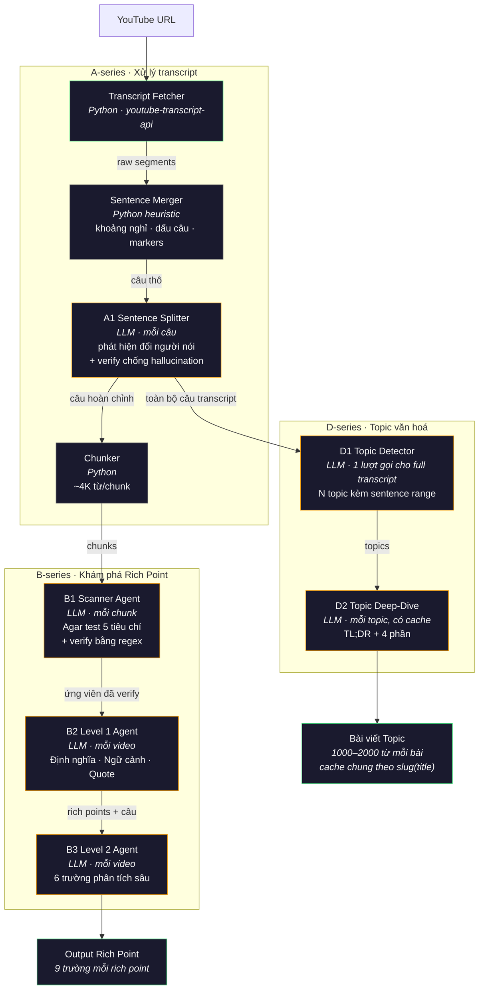

# Agent: Khám phá Rich Point + Topic văn hoá

Hệ thống nhiều agent đọc transcript YouTube và sinh ra hai luồng output song song:

1. **Rich points** — ý nghĩa văn hoá ở cấp từ/cụm từ (rich point theo Michael Agar) với 9 trường thông tin mỗi từ.
2. **Topic văn hoá (cultural topics)** — luồng văn hoá ở cấp video, kèm bài deep-dive dài cho mỗi topic.

Cả hai nhánh đều ăn output của A-series và chạy độc lập.

---

## Kiến trúc (architecture)



> Node viền vàng = LLM agent. Node viền xanh lá = Python / input-output. Node viền xám = Python heuristic.

A-series cấp dữ liệu cho cả B-series lẫn D-series. Hai nhánh không dùng chung state nào nên có thể chạy song song.

---

## Các agent

> **Giọng văn (voice & tone) — thương hiệu ViVii.** Các agent có prose hiển thị cho người dùng (B2, B3, D2) đều áp tone ViVii: **casually profound** chủ đạo, **deadpan** nhẹ, viết tiếng Anh, ưu tiên rõ ràng hơn dí dỏm. Nguồn: [`vivii-brand-identity-keywords (1).md`](vivii-brand-identity-keywords%20%281%29.md), [`vivii-ux-writing-guidelines (1).md`](vivii-ux-writing-guidelines%20%281%29.md). Các agent thiên về cấu trúc (A1, B1, D1) trả về định danh JSON nên không áp tone prose.

### A-series — Xử lý transcript

#### Transcript Fetcher ([apps/transcript.py](apps/transcript.py))

Không phải LLM agent. Dùng `youtube-transcript-api` để lấy auto-caption từ YouTube.

- **Input:** URL YouTube
- **Output:** `{ segments, sentences, full_text, word_count }`
- **Lưu ý:** một số video không có caption → skip kèm lỗi.

#### Sentence Merger + Splitter + Chunker ([apps/chunker.py](apps/chunker.py), [agents/A1_splitter/](agents/A1_splitter/))

Ba bước tiền xử lý:

**Bước 1 — Segments → câu thô** (`segments_to_sentences`, heuristic). Auto-caption của YouTube về theo các mảnh 2–5 từ. Hàm này gộp thành câu dựa vào khoảng nghỉ thời gian (>1 giây), dấu câu kết thúc, marker trong ngoặc (`[Laughter]`) và giới hạn cứng 80 từ/câu.

**Bước 2 — A1 LLM Sentence Splitter** ([agents/A1_splitter/agent.py](agents/A1_splitter/agent.py)). LLM tách câu thô nhỏ hơn nữa khi có đổi người nói, chuyển ngữ pháp, hoặc câu cụt ("yeah", "oh") bị dính vào. **Kiểm tra chống hallucination:** sau khi LLM trả các phần, code ghép lại và so sánh với text gốc. Lệch dù 1 ký tự → từ chối kết quả, giữ câu gốc.

**Bước 3 — Câu → chunks** (`sentences_to_chunks`). Gom câu thành chunk ~4K từ cho B1, không bao giờ cắt giữa câu.

### B-series — Khám phá Rich Point (giữ nguyên)

#### B1 — Scanner Agent ([agents/B1_scanner/](agents/B1_scanner/))

Đọc từng chunk và đề xuất rich point ứng viên (candidates).

- **Model:** `SCANNER_MODEL` (mặc định `llama-3.3-70b-versatile`)
- **Input:** 1 chunk (~4K từ)
- **Output:** `{ candidates: [{ word, type, pos, sense_tag, agar_score }] }`
- **Prompt:** 5 tiêu chí Agar (cần ≥3/5) + ví dụ phản (negative examples) để tránh over-flag (vd "cool", "gonna").
- **Chống hallucination:** sau khi LLM trả về, regex check rằng từ ứng viên có thật trong transcript. Không có → bỏ + ghi log.

#### B2 — Level 1 Agent ([agents/B2_level1/](agents/B2_level1/))

Lấy ứng viên đã verify và thêm 3 trường "hiểu từ" cho mỗi từ.

- **Model:** `LEVEL1_MODEL`
- **Trường output:** `definition`, `context_meaning`, `transcript_quote`, `timestamp_seconds`.

#### B3 — Level 2 Agent ([agents/B3_level2/](agents/B3_level2/))

Lấy output Level 1 và thêm 6 trường phân tích sâu.

- **Model:** `LEVEL2_MODEL`
- **Trường output:** `why_rich_point`, `misuse_consequence`, `origin_story`, `when_to_use`, `related_rich_points`, `outsider_rephrase`.

B2 + B3 ghép lại cho **9 trường mỗi rich point**.

### D-series — Topic văn hoá

D-series ăn trực tiếp output câu từ A-series. Không phụ thuộc B-series.

#### D1 — Topic Detector ([agents/D1_topic_detector/](agents/D1_topic_detector/))

Một lượt gọi LLM thấy toàn bộ transcript và trả về N topic văn hoá ở cấp video, mỗi topic gắn vào một range câu liên tục.

- **Model:** `TOPIC_DETECTOR_MODEL` (mặc định `openai/gpt-oss-120b` — model suy luận mạnh hơn vì phải nhìn cả transcript trong 1 lượt)
- **Input:** câu transcript (kèm timestamp) từ A1
- **Trường output mỗi topic:**

| Trường | Kiểu | Ý nghĩa |
|---|---|---|
| `title` | `string (≤10 từ)` | Tiêu đề tiếng Anh ngắn đặt tên cho topic |
| `short` | `string` | Tagline 1–2 câu cho đối tượng người ngoài (outsider) |
| `sentence_range` | `[int, int]` | Khoảng index câu (bao gồm 2 đầu) trong transcript đầu vào |
| `time_range` | `[int, int]` | `[start_ms, end_ms]` suy ra từ range câu |
| `confidence` | `float (0–1)` | D1 chắc tới đâu rằng topic là coherent (loại bỏ <0.5) |
| `evidence_quotes` | `string[]` | 2–3 quote verbatim từ transcript |

- **Không có catalog, không canonicalize.** Topic là free-form theo từng video. Hai video có thể sinh topic title gần giống nhau — D2 xử lý dedup ở tầng bài viết qua cache theo slug.
- **Rỗng cũng OK.** Nội dung thuần observational, không có yếu tố văn hoá cụ thể → trả `{"topics": []}`.

#### D2 — Topic Deep-Dive ([agents/D2_topic_deep_dive/](agents/D2_topic_deep_dive/))

Một bài dài cho mỗi topic.

- **Model:** `TOPIC_DEEP_DIVE_MODEL` (mặc định `llama-3.3-70b-versatile`)
- **Input:** 1 topic từ D1 (`title`, `short`, `evidence_quotes`)
- **Schema output:** `{ topic_title, tl_dr, sections: { historical_context, cultural_significance, common_misunderstandings, related_references }, word_count }`
- **Độ dài đích:** 1000–2000 từ; TL;DR ≤100 từ là bắt buộc.
- **Cache:** cache theo file tại `<output_dir>/d2_articles/<slug>.json`, với `slug = slug(topic.title)`. **Dùng chung cross-video:** hai video sinh ra topic title giống nhau sẽ trỏ vào cùng cache entry, tốn đúng 1 lượt LLM.

---

## Rich point và topic văn hoá là gì

### Rich point (Michael Agar)

> "Rich point là khoảnh khắc khác biệt văn hoá/ngôn ngữ phá vỡ kỳ vọng của bạn, gây hiểu lầm — và chính sự hiểu lầm đó trở thành điểm khởi đầu để khám phá và học một hệ thống ý nghĩa mới."

**Agar test** (cần ≥3/5):

1. **Dịch nghĩa sụp đổ (translation collapse)** — dịch literal mất tầng văn hoá
2. **Phá vỡ kỳ vọng (expectation breaking)** — người ngoài hỏi "câu này nghĩa là gì?"
3. **Cần bối cảnh văn hoá** — cần biết context Mỹ
4. **Không có tương đương 1:1** — đa số văn hoá khác không có cụm tương đương
5. **Tín hiệu insider (insider signal)** — dùng đúng = thuộc nhóm; dùng sai = ngoài nhóm

### Topic văn hoá

Luồng văn hoá ở cấp video — rộng hơn một từ, hẹp hơn toàn bộ transcript. Mỗi topic kéo dài qua một range câu liên tục, nơi người nói bám vào một mạch văn hoá duy nhất.

Ví dụ:
- "Internet flattening regional American accents"
- "Code-switching pressure on Black professionals in white workplaces"
- "Suburban dad culture in the 1990s"

---

## Cấu trúc file

```
EUP04. ViVii-Agent-Richpoint-Discovery/
  readme.md
  CLAUDE.md            Quy tắc project

  apps/
    main.py              CLI entry: chạy pipeline cho 1 URL
    app.py               Web UI (Flask)
    config.py            API key, tên model, cấu hình chunk
    transcript.py        Lấy transcript YouTube + dựng câu
    chunker.py           Python thuần: segments → câu → chunks
    llm_utils.py         Helper gọi LLM chung (xử lý lỗi, trích JSON)
    schemas.py           Model Pydantic (tolerant — null → mặc định)
    .env                 GROQ_API_KEY (đã gitignore)
    .gitignore

  agents/                ← Mỗi sub-agent một thư mục; prompt nằm cạnh code
    __init__.py
    A1_splitter/                 ← A-series: tiền xử lý dùng chung
      agent.py         LLM splitter câu (kèm verify chống hallucination)
      prompt.py        SPLITTER_SYSTEM
    B1_scanner/                  ← B-series: Khám phá Rich Point
      agent.py         Scanner agent + verify regex
      prompt.py        SCANNER_SYSTEM
    B2_level1/
      agent.py         Level 1 agent (định nghĩa / context / quote)
      prompt.py        LEVEL1_SYSTEM
    B3_level2/
      agent.py         Level 2 agent (6 trường phân tích sâu)
      prompt.py        LEVEL2_SYSTEM
    D1_topic_detector/           ← D-series: Topic văn hoá
      agent.py         1 lượt gọi LLM full transcript → list topic
      prompt.py        D1_SYSTEM
    D2_topic_deep_dive/
      agent.py         Bài dài per topic, cache file theo slug
      prompt.py        D2_SYSTEM

  templates/
    index.html         Template web UI
  static/
    app.js             Logic frontend
    style.css          Dark theme
```

**Quy ước import:** entry point (`apps/main.py`, `apps/app.py`) import qua package `agents` và module trần `apps/`. Lúc chạy, `PYTHONPATH` phải bao gồm cả `apps/` lẫn thư mục gốc project.

---

## Cách chạy

### CLI

```bash
cd EUP04.\ ViVii-Agent-Richpoint-Discovery
python -m venv .venv && source .venv/bin/activate && pip install groq youtube-transcript-api pydantic flask

export GROQ_API_KEY="your-key"
cd apps
PYTHONPATH=..:. python main.py "https://www.youtube.com/watch?v=VIDEO_ID"
```

Output ghi ra `apps/output/<job_id>/job.json` và `apps/output/<job_id>/d2_articles/*.json`.

### Web UI

```bash
cd apps
PYTHONPATH=..:. python app.py
```

Mở http://localhost:5001 → paste URL YouTube → Analyze.

Các tab:
- **Overview** — đếm số liệu (rich point, topic, bài viết, từ)
- **Rich Points** — 9 trường mỗi từ, kèm transcript quote + timestamp
- **Cultural Topics** — card topic D1 mở ra có bài deep-dive D2 inline (TL;DR + 4 phần)
- **Transcript** — toàn bộ transcript với highlight rich point

---

## Dependencies

| Package | Mục đích |
|---|---|
| `groq` | Client API LLM |
| `youtube-transcript-api` | Lấy caption YouTube (không cần API key) |
| `pydantic` | Validate output có cấu trúc |
| `flask` | Server web UI |

---

## Giới hạn tốc độ (rate limit — Groq free tier)

- **100K token/ngày/model** — hết quota model nào thì đổi sang model khác trong `config.py`.
- **12K token/phút** — B1 đã batch 3 ứng viên/lượt và delay 10s giữa các batch.
- Nếu dùng Groq paid tier hoặc Claude API: bỏ delay và chạy hai nhánh song song.
- **D1 mặc định `openai/gpt-oss-120b`** (model Groq khác có quota tách riêng) để D-series và B-series không tranh token.

---

## Đổi LLM provider

Sửa `apps/config.py` để đổi model. Sửa `agents/<name>/agent.py` để đổi client API (Groq → Anthropic/OpenAI). Prompt hệ thống của từng agent nằm ở `agents/<name>/prompt.py` và không phụ thuộc provider.

## Sửa prompt 1 agent

Mỗi agent có file prompt riêng. Muốn chỉnh prompt Scanner, mở [agents/B1_scanner/prompt.py](agents/B1_scanner/prompt.py) — không ảnh hưởng các agent khác.
